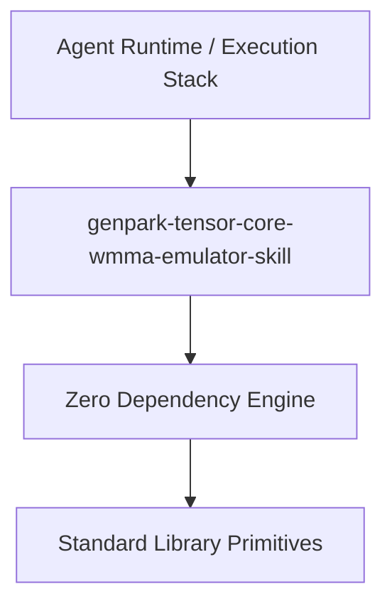

# genpark-tensor-core-wmma-emulator-skill

[](https://github.com/alphaparkinc/genpark-tensor-core-wmma-emulator-skill)
[](https://github.com/alphaparkinc/genpark-tensor-core-wmma-emulator-skill)
[](https://www.python.org/)

Tensor Core Warp Matrix Multiply-Accumulate (WMMA) micro-tile systolic array emulator supporting outer-product GEMM and shared memory bank conflict reduction.



## Features
- **Strict 0 Pip Dependencies**: Built completely using the Python Standard Library.
- **Fast Execution & Verification**: Includes client wrapper, MCP server, and verified test suites.
- **Agentic AI Ready**: Exposes standard MCP tools for continuous LLM integration.

## Installation & Quickstart
```bash
git clone https://github.com/alphaparkinc/genpark-tensor-core-wmma-emulator-skill.git
cd genpark-tensor-core-wmma-emulator-skill
python example_usage.py
```
